# ResumeMaster: AI-Driven Resume Analyzer

ResumeMaster is an AI-powered application designed to parse and analyze resumes using natural language processing (NLP). It extracts keywords, categorizes them into relevant sectors, and offers recommendations, predictions, and analytics to applicants based on keyword matching.

## Features

- **Resume Parsing:** Extracts structured data from resumes for detailed analysis.
- **Keyword Clustering:** Identifies and groups keywords into relevant sectors.
- **Recommendations:** Provides suggestions and predictions to enhance resume quality.
- **Analytics:** Offers insights based on keyword matching to improve job application success.

## Tech Stack

- **Frontend:** Streamlit, HTML, CSS, JavaScript
- **Backend:** Python (Streamlit)
- **Database:** MySQL
- **Modules:** pandas, pyresparser, pdfminer3, Plotly, NLTK

## Scope

- **Data Structuring:** Converts resume data into structured formats for organizational analytics.
- **User Improvement:** Assists users in refining their resumes through feedback and recommendations.
- **Educational Insights:** Enables educational institutions to assess student resumes before placements.
- **Continuous Enhancement:** Gathers user feedback for ongoing tool improvement.

## Screenshots

### 1. Admin:
- **Main Screen:**
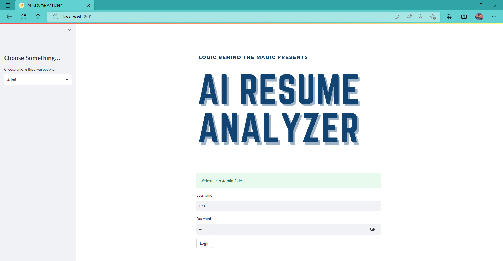

- **User Data:**
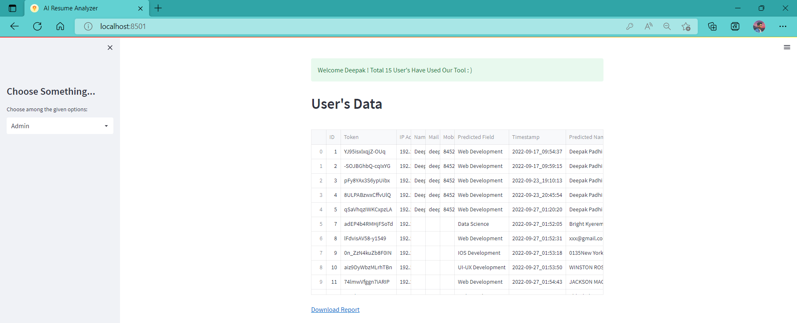

- **User DataCSV:**
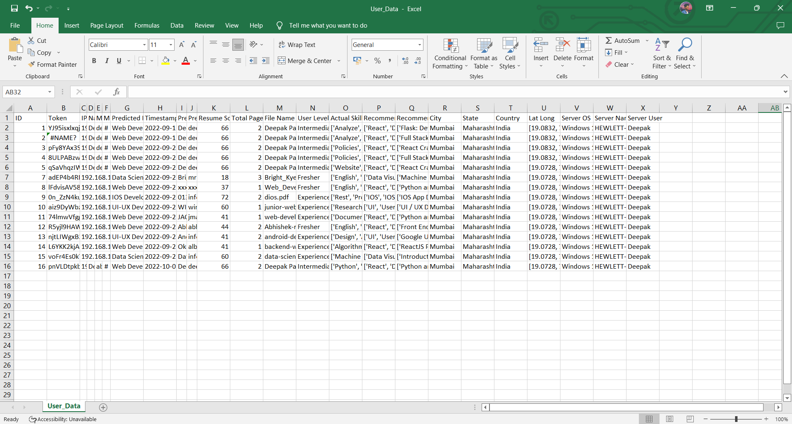

- **Feed Data:**
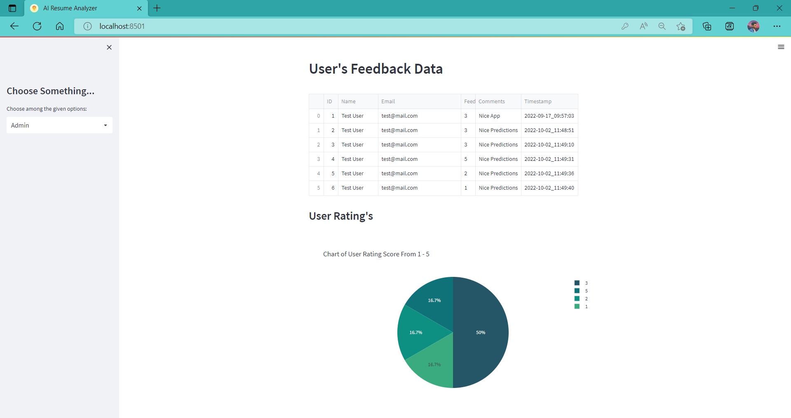

- **Pie Experienced Level:**
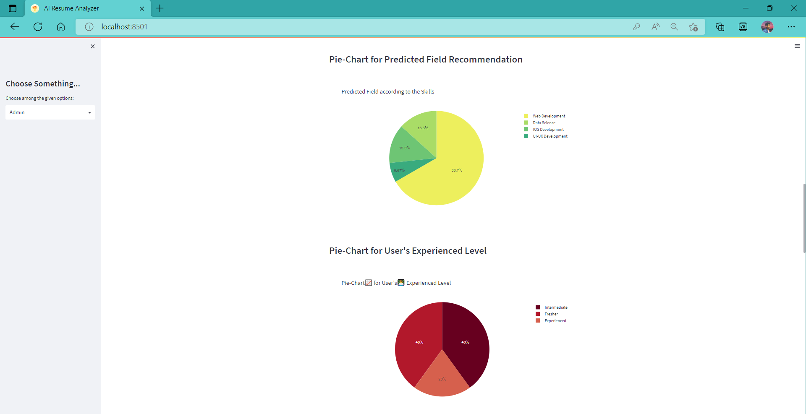

- **Pie Resume Score:**
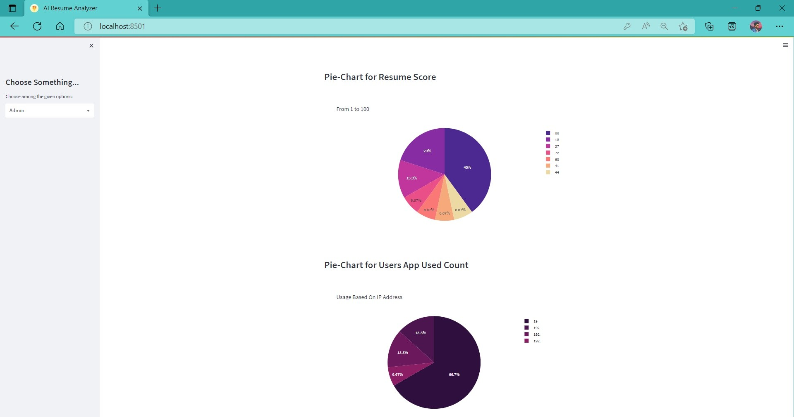

- **Pie Location:**
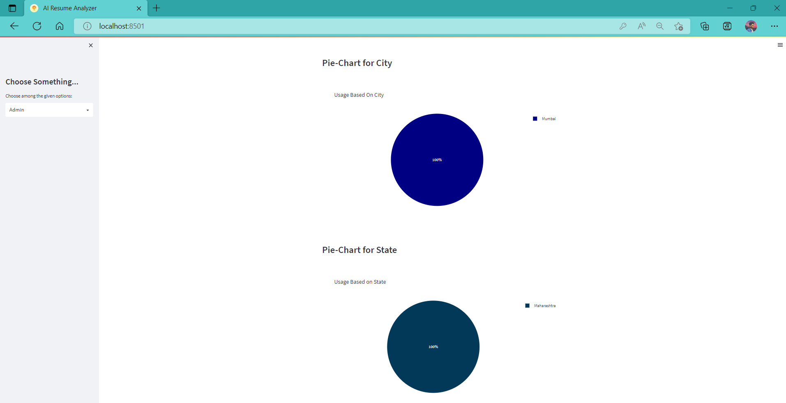

### 2. Feedback:
- **Form:**
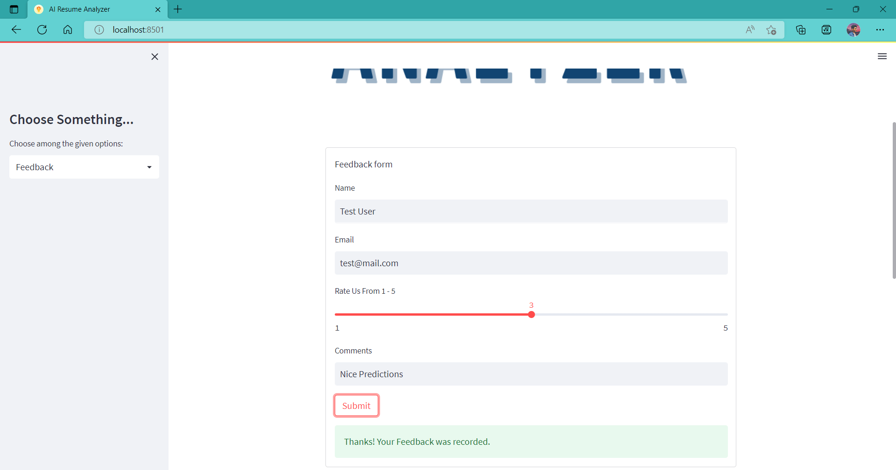

- **Analytics:**
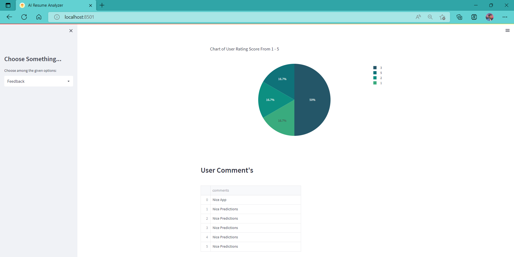

### 3. User:
- **Main Screen:**
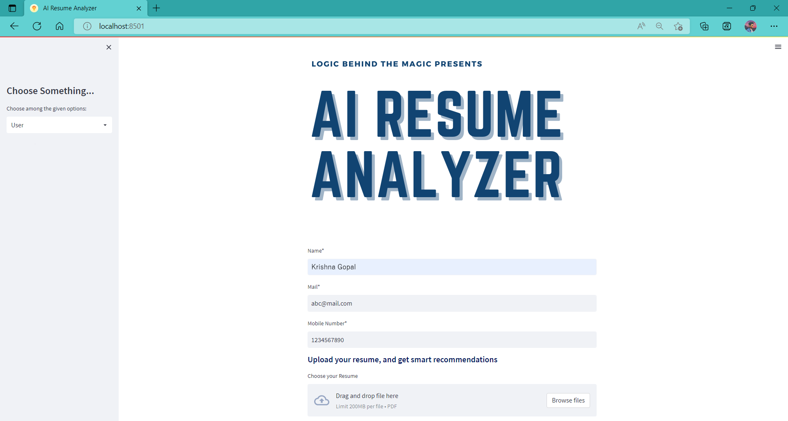

- **Analysis:**
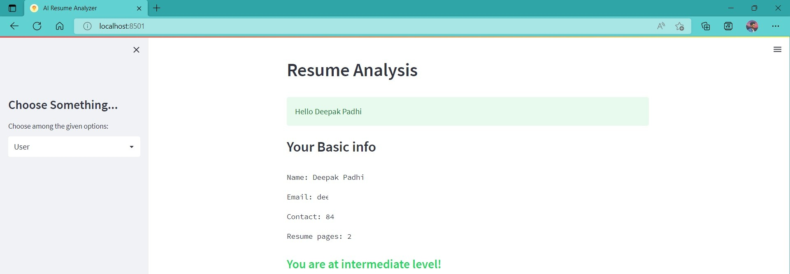

- **Skills Recommendation:**
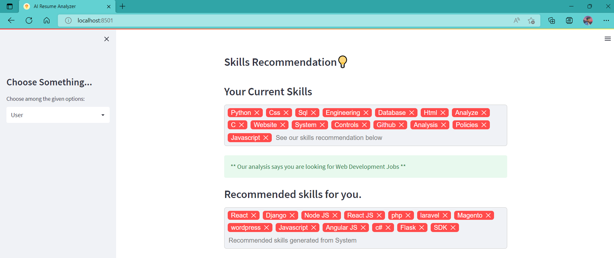

- **Course Recommendation:**
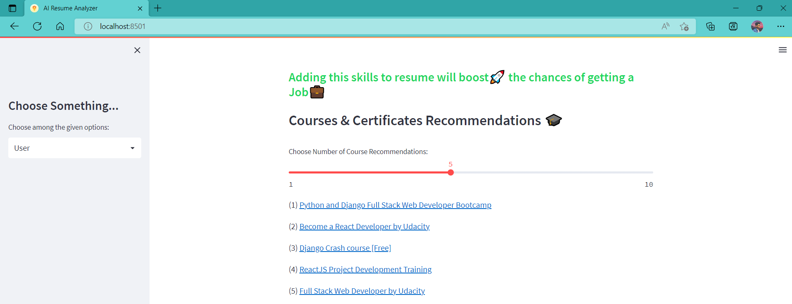

- **Resume Score:**
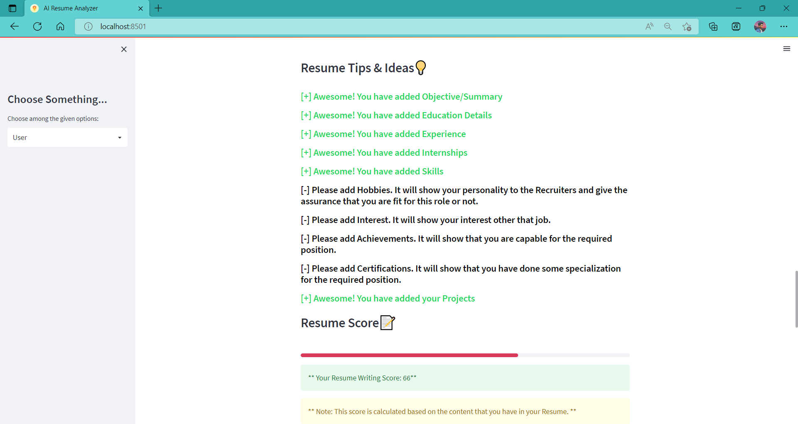

- **Video Tips:**
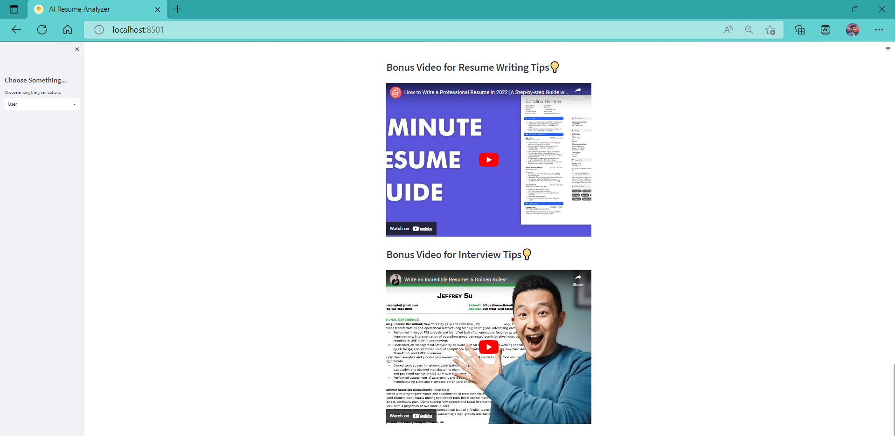

## Installation & Setup

### 1. Clone the Repository
```bash
git clone https://github.com/your-username/ResumeMaster.git

cd ResumeMaster
```

## 2. Install Dependencies
```bash
pip install -r requirements.txt
```

## 3. Run the Application
```bash
streamlit run app.py
```

## License

This project is licensed under the MIT License.
